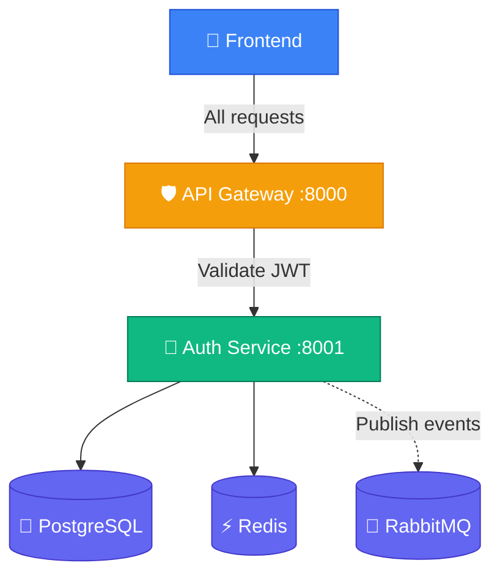
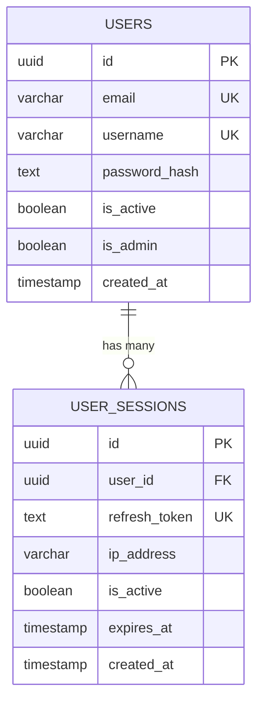
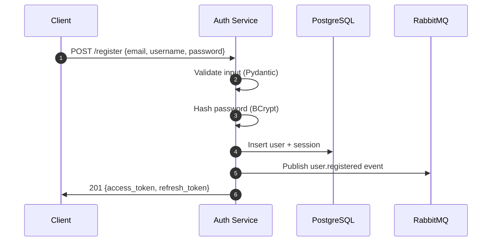

# 🔐 Roadmap-Hub Auth Service

> Identity & Access Management microservice for the RoadmapHub ecosystem.  
> Built with **FastAPI** · **SQLAlchemy 2.0 (Async)** · **PostgreSQL** · **JWT** · **RabbitMQ**

---

## Architecture



## Tech Stack

| Layer | Technology |
| :--- | :--- |
| Framework | FastAPI 0.111 |
| ORM | SQLAlchemy 2.0 (Async) |
| Database | PostgreSQL 16 |
| Migrations | Alembic |
| Auth | JWT (python-jose) + BCrypt (passlib) |
| Messaging | RabbitMQ (aio-pika) |
| Cache | Redis |
| Server | Uvicorn (ASGI) |

## Project Structure

```
auth-service/
├── app/
│   ├── main.py           # FastAPI entry point
│   ├── config.py          # Environment settings (pydantic-settings)
│   ├── database.py        # Async database engine & session
│   ├── auth.py            # JWT & password hashing utilities
│   ├── events.py          # RabbitMQ event publisher
│   ├── models/
│   │   └── models.py      # SQLAlchemy models (User, UserSession)
│   ├── schemas/
│   │   └── auth.py        # Pydantic request/response schemas
│   └── routers/
│       └── auth.py        # API endpoint definitions
├── alembic/               # Database migration scripts
├── alembic.ini            # Alembic configuration
├── Dockerfile             # Container build recipe
├── requirements.txt       # Python dependencies
└── .env                   # Environment variables (not committed)
```

## API Endpoints

| Method | Endpoint | Description | Auth |
| :--- | :--- | :--- | :--- |
| `POST` | `/api/v1/auth/register` | Create a new user account | Public |
| `POST` | `/api/v1/auth/login` | Authenticate and get tokens | Public |
| `POST` | `/api/v1/auth/refresh` | Exchange refresh token for new access token | Refresh Token |
| `POST` | `/api/v1/auth/logout` | Invalidate a refresh token | Refresh Token |
| `GET` | `/api/v1/auth/me` | Get current user profile | `X-User-ID` Header |
| `GET` | `/api/v1/auth/validate` | Verify a JWT (used by API Gateway) | Bearer Token |
| `GET` | `/healthz` | Health check | Public |

## Database Schema



## Auth Flow



## Quick Start

### Prerequisites
- Docker Desktop (for PostgreSQL, Redis, RabbitMQ)
- Python 3.12+

### Run Locally

```bash
# 1. Start infrastructure (from project root)
docker compose up -d auth-db redis rabbitmq

# 2. Setup Python environment
cd backend/auth-service
python -m venv .venv
source .venv/bin/activate        # Linux/Mac
# .\.venv\Scripts\Activate.ps1   # Windows

# 3. Install dependencies
pip install -r requirements.txt

# 4. Configure environment
cp .env.example .env             # Edit with your values

# 5. Run migrations
PYTHONPATH=. alembic upgrade head

# 6. Start the server
uvicorn app.main:app --port 8001 --reload
```

### Test

```bash
# Register
curl -X POST http://localhost:8001/api/v1/auth/register \
  -H "Content-Type: application/json" \
  -d '{"email":"test@test.com","username":"testuser","password":"password123"}'

# Login
curl -X POST http://localhost:8001/api/v1/auth/login \
  -H "Content-Type: application/json" \
  -d '{"email":"test@test.com","password":"password123"}'

# Validate (replace TOKEN)
curl http://localhost:8001/api/v1/auth/validate \
  -H "Authorization: Bearer TOKEN"
```

## Docker

```bash
docker build -t roadmaphub-auth-service .
docker run -p 8001:8001 --env-file .env roadmaphub-auth-service
```

## Environment Variables

| Variable | Required | Description |
| :--- | :--- | :--- |
| `DATABASE_URL` | ✅ | PostgreSQL connection string |
| `JWT_SECRET` | ✅ | Secret key for signing JWTs |
| `REDIS_URL` | ❌ | Redis connection (default: `redis://redis:6379/1`) |
| `RABBITMQ_URL` | ❌ | RabbitMQ connection string |
| `ACCESS_TOKEN_EXPIRE_MINUTES` | ❌ | JWT lifetime (default: 15) |
| `REFRESH_TOKEN_EXPIRE_DAYS` | ❌ | Refresh token lifetime (default: 30) |

## Part of the RoadmapHub Ecosystem

| Repository | Purpose |
| :--- | :--- |
| [Roadmap-Hub-DevOps](https://github.com/Gautam4424/Roadmap-Hub-DevOps) | Infrastructure & Orchestration |
| [SkillForge](https://github.com/Gautam4424/SkillForge) | React Frontend |
| **Roadmap-Hub-auth-service** | **This repo** — Authentication |
| [Roadmap-Hub-api-gateway](https://github.com/Gautam4424/Roadmap-Hub-api-gateway) | API Gateway |
| [Roadmap-Hub-roadmap-service](https://github.com/Gautam4424/Roadmap-Hub-roadmap-service) | Roadmap CRUD |
| [Roadmap-Hub-progress-service](https://github.com/Gautam4424/Roadmap-Hub-progress-service) | User Progress Tracking |

---

**License**: MIT
